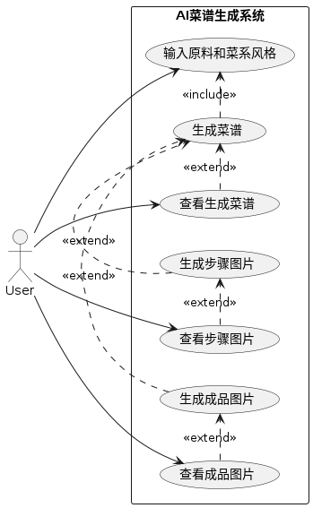
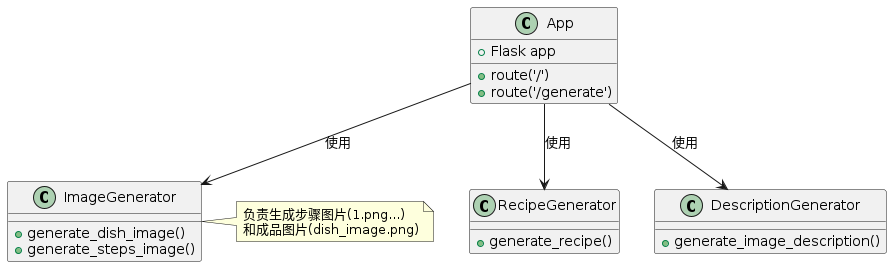
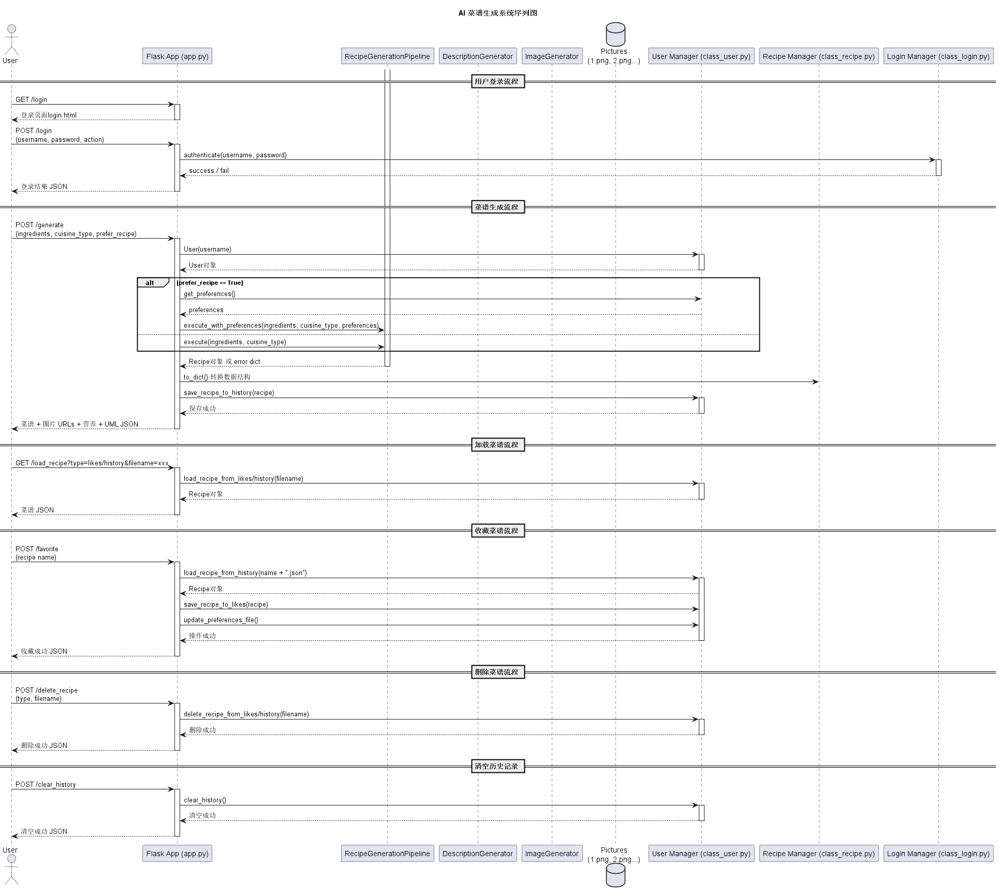
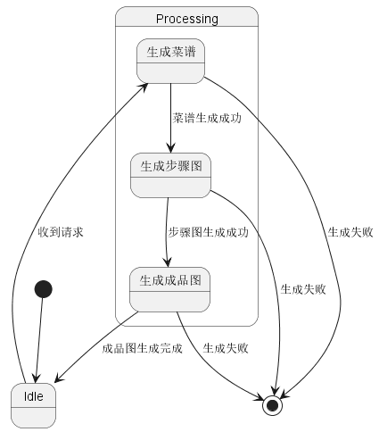

# AI 菜谱生成系统建模报告

本报告基于系统的设计需求与实现代码，详细描述了AI菜谱生成系统的各个视角模型，包括用例图、类图、顺序图和状态图。所有模型均以PlantUML绘制，并生成对应的PNG图片文件。

---

## 目录

1. [系统用例图 (user_case.png)](#系统用例图-user_casepng)
2. [系统类图 (class.png)](#系统类图-classpng)
3. [系统顺序图 (sequence.png)](#系统顺序图-sequencepng)
4. [系统状态图 (state.png)](#系统状态图-statepng)

---

## 系统用例图 (user_case.png)

该用例图展示了系统的主要功能模块及用户交互行为，涵盖了以下几个核心用例：

- **用户登录/注册**：用户通过登录界面进行认证，成功登录后访问系统功能。
- **菜谱生成**：用户输入食材及菜系，系统调用AI模型生成完整菜谱，包括步骤、图片和营养信息。
- **菜谱管理**：
  - 查看历史生成的菜谱
  - 收藏喜欢的菜谱
  - 删除收藏或历史菜谱
  - 清空历史记录
- **用户偏好管理**：系统基于用户收藏自动生成饮食偏好，用于个性化推荐。

用户作为主角，通过浏览器与系统交互，整个过程以Web请求为核心，后端完成菜谱生成及用户数据管理。

---

## 系统类图 (class.png)

类图全面描述了系统的核心类及它们之间的关系，主要包含：

- **App**：Flask应用的主入口，负责路由管理和请求调度。
- **RecipeGenerationPipeline**：菜谱生成流水线，封装菜谱生成、图片生成、描述生成、营养分析等多个步骤。
- **User**：用户数据管理类，维护用户的收藏夹、历史记录及偏好文件，负责数据的增删改查。
- **Recipe**：菜谱实体，包含名称、步骤、图片、营养信息及UML顺序图数据，支持转换为字典便于传输。
- **login**：用户登录管理类，实现用户注册、认证及用户信息加载。

类之间的依赖关系清晰：App调用Pipeline完成菜谱生成，User管理个人数据，login负责身份验证。图片生成和描述生成为Pipeline内部分步骤的抽象，承担具体图像及文字内容生成任务。

---

## 系统顺序图 (./sequence.png)

顺序图详细描述了系统核心交互流程，涵盖以下几个阶段：

- **用户登录流程**  
  用户访问登录页面，提交用户名密码，系统通过`login`类验证，反馈登录结果。

- **菜谱生成流程**  
  用户提交原料和菜系，App根据用户是否选择偏好生成调用`RecipeGenerationPipeline`，执行菜谱生成。  
  流程中调用描述生成、步骤图片生成、成品图片生成模块，图片保存至数据库。  
  生成完成后，菜谱结果保存至用户历史记录，返回给用户完整的菜谱信息和相关图片URL。

- **菜谱加载流程**  
  用户请求加载历史或收藏菜谱，App通过User类读取对应数据并返回。

- **菜谱收藏、删除及历史清空流程**  
  用户操作收藏、删除菜谱，或清空历史记录，系统调用User类完成数据操作，返回操作结果。

该顺序图清晰展现了系统内各模块协同工作，确保用户请求高效完成。

---

## 系统状态图 (./state.png)

状态图描述了菜谱生成流水线`RecipeGenerationPipeline`的生命周期及状态转换过程：

- 初始状态为等待输入用户原料和偏好信息。
- 接收到输入后，进入生成状态，依次调用：
  - 菜谱生成
  - 菜谱命名
  - 菜品外观描述生成
  - 菜品主图像生成
  - 营养分析生成
  - UML顺序图生成
  - 制作步骤图片生成
- 每一步完成后状态转移至下一步骤，所有生成成功后，状态转换至完成状态，输出完整Recipe对象。
- 若任一步骤失败，则进入失败状态，反馈错误信息。

该状态图体现了流水线的严格流程控制和错误管理机制，保障生成过程的健壮性。

---

# 总结

本系统通过完整的用例分析、类设计、交互流程和状态管理，建立了清晰可维护的AI菜谱生成框架。  
各模型图相互补充，为开发和后续维护提供了强有力的设计依据。

---

# 附件图片文件

- `user_case.png` — 用例图
- `class.png` — 类图
- `sequence.png` — 顺序图
- `state.png` — 状态图
