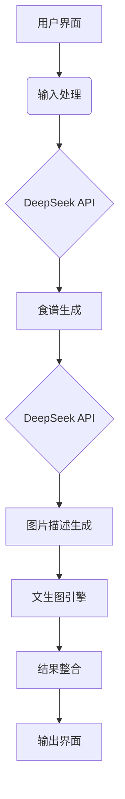

# 食谱生成助手软件文档
**版本号**: 1.0  
**最后更新日期**: [填写日期]

---

## 一、产品概述
### 1.1 目标
为用户提供智能化食谱生成服务，通过AI技术实现：
- 根据用户现有食材自动生成创意食谱
- 通过文字描述生成对应菜品示意图
- 整合输出可打印/分享的图文菜谱

### 1.2 目标用户
- 家庭烹饪爱好者
- 食材库存管理用户
- 创意菜品开发者

---

## 二、系统架构


---

## 三、核心功能模块
### 3.1 输入模块
- **食材输入**：
  - 支持多食材输入（逗号分隔/多行输入）
  - 可选参数：
    - 忌口偏好（素食/无麸质等）
    - 烹饪难度
    - 预期烹饪时间

### 3.2 AI处理引擎
| 处理阶段       | 输入                | 输出示例                          | 技术实现                   |
|----------------|---------------------|-----------------------------------|--------------------------|
| 食谱生成       | 鸡蛋,番茄           | 番茄炒蛋菜谱（含步骤/用料）       | DeepSeek烹饪模型调优     |
| 图片描述生成   | 生成的食谱文本      | "金黄蓬松的炒蛋与鲜红番茄块..."   | 文本摘要+风格化处理      |
| 图片生成       | 风格化描述          | 1024x1024像素菜品图片             | Stable Diffusion/DALL·E  |

### 3.3 输出模块
- **图文整合**：
  - PDF输出：包含食材清单、步骤说明、AI生成图片
  - 网页预览：响应式布局展示
  - 社交分享：生成9:16竖版分享图

---

## 四、技术实现
### 4.1 技术栈
- **前端**：Streamlit/PyQt
- **后端**：Python + FastAPI
- **AI服务**：
  ```python
  # 示例API调用伪代码
  def generate_recipe(ingredients):
      prompt = f"根据以下食材生成详细菜谱：{ingredients}，要求包含："
              "1.所需辅料 2.分步说明 3.烹饪技巧"
      return deepseek.chat.completions.create(
          model="cooking-pro",
          messages=[{"role": "user", "content": prompt}]
      )
  ```

### 4.2 关键算法
- **输入处理**：
  - 食材标准化（同义词转换）
  - 合理性检查（避免危险组合）

- **提示工程**：
  ```python
  # 图片描述生成提示模板
  IMAGE_PROMPT_TEMPLATE = """
  请将以下菜谱转换为图片描述，要求：
  1. 包含主要食材的视觉特征
  2. 描述餐具/摆盘风格
  3. 使用生动形容词
  4. 长度不超过100字
  
  菜谱内容：{recipe_text}
  """
  ```

---

## 五、使用示例
### 5.1 典型用户流程
1. 输入：鸡蛋、西红柿、青椒
2. 生成菜谱：
   ```
   三色炒蛋
   食材：鸡蛋3个，西红柿1个，青椒1个...
   步骤：1. 鸡蛋打散... 
   ```
3. 生成图片描述："平底锅中金黄色的嫩滑炒蛋..."
4. 输出结果：
   - 图文PDF菜谱
   - 分享用手机壁纸

---

## 六、安全与合规
- 用户数据加密存储
- 图片生成内容过滤机制
- 食谱安全检测（避免建议生食危险食材）

---

## 附录
A. API密钥配置指南  
B. 本地部署依赖清单  
C. 常见问题排查

---

建议开发时采用模块化开发流程，优先实现核心的食谱生成链路，再逐步完善UI/UX和异常处理机制。需要特别关注AI生成内容的可靠性和图片生成的质量控制。
